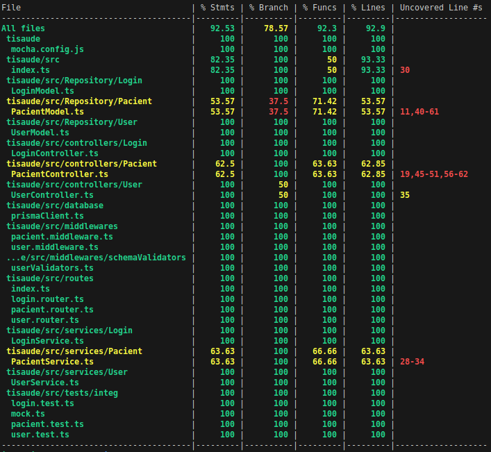
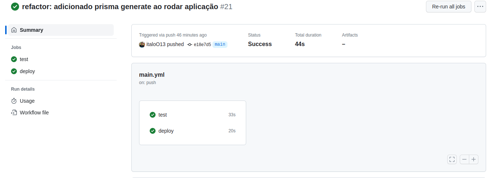

<h1 align="center">
     <a href="https://backend-production-90db.up.railway.app/" alt="api">API - TI Saúde</a>
</h1>

<h3 align="center">
    Este projeto tem como objetivo mostrar meus conhecimentos a equipe ti.saúde.
</h3>

<h4 align="center">
	🚧   Completo 🚀 🚧
</h4>

---

## 💻 Sobre o projeto

Criei este projeto por conta própria com o intuito de demonstrar meu comprometimento e habilidades técnicas. Tenho a esperança de que esse projeto sirva como uma forma adicional de evidenciar minhas competências para a equipe da Ti Saúde.

### Link para o backEnd deployado: https://backend-production-90db.up.railway.app/

 ### A aplicação tem as funcionalidades de:

  - Cadastro de usuários (Médicos)
  - Login com JWT
  - CRUD para cadastro de pacientes

  ### Foi utilizado as seguintes tecnologias:
    Back End
    - Node js com Typescript
    - Docker
    - JWT
    - Testes de integração com Mocha, chai , sinon.
    - MYSQL - Prisma
    - Arquitetura MSC
    CI/CD
    - Github Actions
    - Railway

---

## 🛠 BackEnd

Para executar localmente o backend:

1- Renomeie o arquivo .env.example para .env

2- Use o comando:

```
$ docker-compose up .
```

### Metodo de session

|Methodo|Rota|Descrição|
| ------ | ------ | ----- |
|post|/session|Retorna um token de acesso|

Formato de requisição para o POST:

```
{
	"email":"MichaelSchumacher@gmail.com",
	"password":"123456"
}
```

### Metodos da rota Users

|Methodo|Rota|Descrição|
| ------ | ------ | ----- |
|get|/user/:id|Retorna um usuário cadastrado com base no id informado|
|post|/user|Cadastra um novo usuário|
|delete|/user/:id|Apaga usuário logado na sessão|

Formato de requisição para o POST e PUT:
```
{
  "name":"Italo Iveldo", 
  "email":"italo2@gmail.com",
  "password":"12345678",
  "crm": "15485248"
}
```

### Metodos da rota Pacients

|Methodo|Rota|Descrição|
| ------ | ------ | ----- |
|get|/pacients/|Retorna todos os pacients cadastrados por um médico|
|get|/pacients/:pacientId|Retorna o pacient com base no id do paciente|
|post|/pacients/|Cadastra um novo pacient|
|delete|/pacients/:pacientId/|Apaga um paciente a partir do id|
|update|/pacients/:pacientId/|Atualiza os dados de um paciente a partir do id|

Formato de requisição para o POST e DELETE:
```
{
  "name":"Italo Ivelooo", 
  "email":"ital@gmail.com",
  "phone":"12345678"
}
```
OBs: Paras as requisições destas rotas é necessário passar o token de login em Header -> Authorization = token

---

## ⚙️ Testes | CI/CD

  Foi desenvolvido 20 testes de integração utilizado as biblioteca mocha, chai e sinon, para rodar os testes localmente execute os seguintes comandos:

```
$ npm test
```
Cobetura de teste:



<br>
<br>

### CI/CD

Os testes de integração foram estabelecidos como pré-requisito antes de qualquer push ou pull_request na branch main por meio do GitHub Actions. Após a conclusão dos testes com êxito, o deploy é realizado automaticamente no Railway.

Imagens do Github Actions rodando:



<br>
<br>

---
